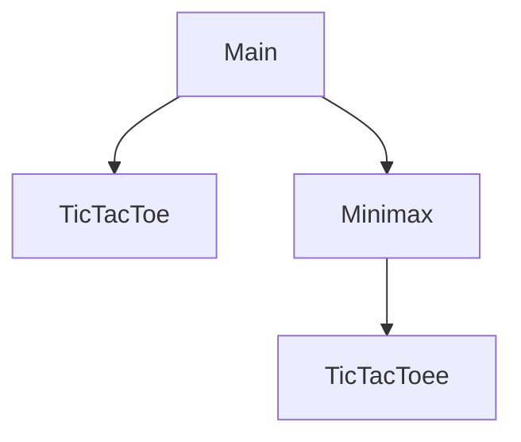

# 🎓 Artificial Intelligence Lab Projects

This repository hosts two core laboratory assignments developed as part of the **Artificial Intelligence** curriculum. The projects focus on exploring state-space search optimization and adversarial decision-making in game theory.

---

## 📖 Table of Contents
1. [Part 1: State-Space Search (A* vs UCS)](#-part-1-state-space-search-a-vs-ucs)
   - [Heuristic Design](#-heuristic-design)
   - [Performance Benchmarking](#-performance-benchmarking)
2. [Part 2: Adversarial Game AI (Custom Tic-Tac-Toe)](#-part-2-adversarial-game-ai-custom-tic-tac-toe)
   - [Game Rules & Mechanics](#-game-rules--mechanics)
   - [Minimax Logic](#-minimax-logic)
   - [System Architecture](#-system-architecture)
3. [🛠️ Tech Stack & Learning Outcomes](#%EF%B8%8F-tech-stack--learning-outcomes)
4. [👥 Author](#-author)

---

## 🧩 Part 1: State-Space Search (A* vs UCS)

### 📌 Overview
This module provides a comparative analysis between **Uniform Cost Search (UCS)** (an uninformed search strategy) and the **A\* (A-Star) Algorithm** (an informed heuristic search). The primary objective is to evaluate how heuristic intelligence minimizes computational overhead while finding optimal paths.

### 🔍 Heuristic Design
To guide the A* search agent, we designed a hybrid heuristic function $h(n)$ combining:
* **Manhattan Distance:** Measuring the physical distance of elements from their target coordinates.
* **Misplaced Tiles count:** Computing the total number of elements currently out of position.

> **Properties of $h(n)$:**
> * **Admissible:** Never overestimates the actual cost to reach the goal state, guaranteeing an optimal solution.
> * **Consistent:** Ensures search efficiency by maintaining monotonicity along the path.

### ⚡ Performance Benchmarking
In all tested scenarios, the informed A* search agent dramatically outperformed UCS by expanding a fraction of the nodes.

| Test Case | UCS Node Expansions | A* Node Expansions | Search Space Reduction |
| :---: | :---: | :---: | :---: |
| **Case 1** | 259,464 | 9,926 | **~96.1%** |
| **Case 2** | 212,830 | 36,822 | **~82.7%** |
| **Case 3** | 295,135 | 32,423 | **~89.0%** |
| **Case 4** | 202,033 | 5,234 | **~97.4%** |
| **Case 5** | 138,186 | 8,210 | **~94.0%** |

---

## 🎮 Part 2: Adversarial Game AI (Custom Tic-Tac-Toe)

### 📌 Overview
An implementation of a modified, highly dynamic variant of the classic Tic-Tac-Toe game. The opponent is powered by an unbeatable AI agent driven by the **Minimax Algorithm**.

### 🧩 Game Rules & Mechanics
* **The Grid:** A standard `3x3` matrix representation (`char[3][3]`).
* **Game Tokens:**
  * `S` $\rightarrow$ Human Player
  * `C` $\rightarrow$ Computer AI
  * `E` $\rightarrow$ Empty cell
* **Dynamic Start:** The game initializes with a movable `S` element on the board.
* **Victory Conditions:** A player wins by successfully forming the exact sequence **`CSE`** or **`ESC`** across any:
  * Horizontal Row
  * Vertical Column
  * Diagonal

### 🧠 Minimax Logic
The AI evaluates the game state recursively to make flawless moves. It maximizes its own utility score while assuming the human player acts to minimize it.
* `findBestMove()`: Interacts with the board state to trigger the decision-making loop.
* `minimax()`: Evaluates future board configurations recursively to determine the mathematically optimal move.

### 🏗️ System Architecture
The project is built around clean object-oriented design patterns in Java:

 * Main.java: Orchestrates the main game loop, handles user inputs, and prints UI messages to the console.
 * TicTacToe.java: Manages the board state, handles turn logic, validates moves, and evaluates win/draw conditions.
 * Minimax.java: Encapsulates the core artificial intelligence decision-making engine.
🛠️ Tech Stack & Learning Outcomes
Technology Stack
Language: Java
Concepts: Search Theory, Algorithmic Game Theory, Graph Traversal
Key Takeaways
Heuristic Application: Practical experience in designing and proofing admissible heuristics.
Algorithm Comparison: Quantitative understanding of the performance gap between informed and uninformed search.
State-Space Modeling: Representing real-world game logic and board states in software structures.
Decision Optimization: Applying adversarial search principles to build self-learning/unbeatable game systems.
👥 Author
IOANNIS RAFAIL TORNARITIS
